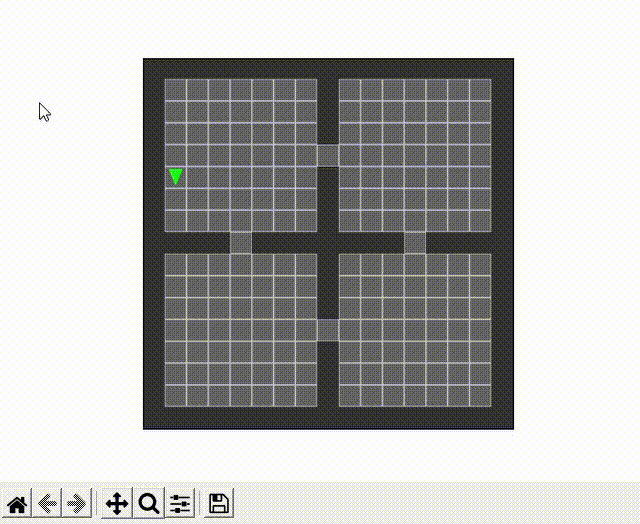

    
# RCVL: Reverse Curriculum Hierarchical Vicinity Learning.


This repository was developed for my master's thesis in Artificial Intelligence. It contains a hierarchical algorithm based on two levels in which the higher level draws the high-level path with milestones (subgoals) and the low hierarchy performs the primitive steps in the sub-trajectories between those milestones.

The algorithm is trained and tested in Simple Minigrid environemt: Empty Room 15x15 and FourRooms 15x15. 


## Dependencies

- [Python](https://img.shields.io/badge/numpy-1.19.2-blue) 3.7
- [PyTorch](https://pytorch.org/) 1.7.1
- [OpenAI Gym](https://www.gymlibrary.dev/) 0.17.2
- [Gym Simple MiniGrid](https://github.com/tairtahar/gym-simple-minigrid.git) 2.0.0 

## Usage

Running experiments:
1. For execution of training please run  `train_rcvl.py`.
Make sure to insert job_name and to adjust any of the parameters if needed.
2. For execution of testing please run `test_rcvl.py`. 
Make sure to insert checkpoint_name, to add the relevant files into the checkpoints directory, and to adjust any of the parameters if needed. 
The files default checkpoint_name is the algorithms that were presented in the thesis for four_rooms environment. 
In addition, in the checkpoint directory, it is possible to find the checkpoint for empty room. 

~
## Trained RCVL agent
<p align="center">
  
</p>


For rendering the test, add `--render` to the configuration file.

## Citation
```bibtex
> @phdthesis{Tahar Tair,
    title={Reverse Curriculum Vicinity Learning},
    url={https://upcommons.upc.edu/handle/2117/371021},
    school={UPC, Computer Science Faculty},
    author={Tahar, Tair},
    year={2022},
    month={July}
}
```


